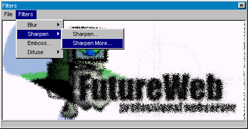



## FPFilter \- Graphics Filter SEE IT \!\!\!

### Description

UPDATED VERSION !!!

Graphic Filters: Updated Version , original by Samantha E. . Now faster and easier. Including how to use a statusbar with a progressbar. easy for understanding. Download and Vote for Samantha E. and me ! bye !
 
### More Info
 

             |
---                |---
**Submitted On**   |2000-04-29 15:33:38
**By**             |[Andreas Schwarz](https://github.com/Planet-Source-Code/PSCIndex/blob/master/ByAuthor/andreas-schwarz.md)
**Level**          |Beginner
**User Rating**    |5.0 (20 globes from 4 users)
**Compatibility**  |VB 5\.0, VB 6\.0
**Category**       |[Custom Controls/ Forms/  Menus](https://github.com/Planet-Source-Code/PSCIndex/blob/master/ByCategory/custom-controls-forms-menus__1-4.md)
**World**          |[Visual Basic](https://github.com/Planet-Source-Code/PSCIndex/blob/master/ByWorld/visual-basic.md)
**Archive File**   |[CODE\_UPLOAD53194292000\.zip](https://github.com/Planet-Source-Code/andreas-schwarz-fpfilter-graphics-filter-see-it__1-7619/archive/master.zip)

